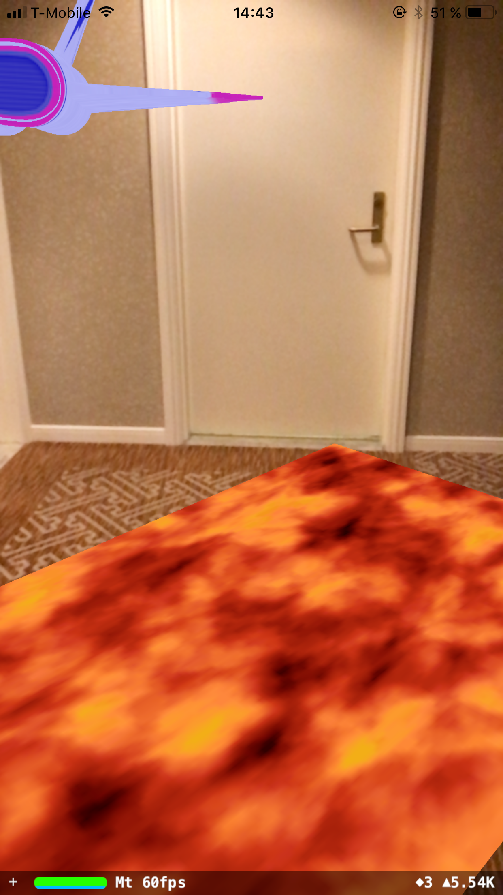

# FloorIsLava
Basic ARKit example that detects planes and makes them lava.



## Requirements
- Xcode 9 (you can view the code in Xcode 8 but will not be able to build the project)
- Device running iOS 11, with an A9 chip or higher (iPhone 6S or newer, iPad Pro)

## Project Walkthrough

Welcome to ARKit! This basic project setup shows how to start an AR session and watch for planes that are detected. We are using an `ARSCNView`, a specially designed SceneKit view that contains an `ARSession`. 

### 1. Configuring and starting the session

The `ARSession` gathers data from the world and processes it. Because we want to place objects on horizontal planes, we need to configure the session to detect them:

```swift
let configuration = ARWorldTrackingSessionConfiguration()
configuration.planeDetection = .horizontal
```

We can then start the session with this configuration by running:

```swift
sceneView.session.run(configuration)
```

### 2. Add a SceneKit node to detected planes

Next, we override the `ARSCNViewDelegate` renderer methods. The SceneView will call these methods when AR "anchors" are detected in the world. Since we've configured the session to detect horizontal planes, these methods will be called for those as well.

In the didAdd method, we check that the discovered node is a plane, then use a helper function to create a simple SceneKit plane. Finally, we add the SceneKit plane as a child of the automatically-generated node for the anchor.

```swift
func renderer(_ renderer: SCNSceneRenderer, didAdd node: SCNNode, for anchor: ARAnchor) {

  guard let planeAnchor = anchor as? ARPlaneAnchor else { return }
  
  let planeNode = createPlaneNode(anchor: planeAnchor)
  
  // ARKit owns the node corresponding to the anchor, so make the plane a child node.
  node.addChildNode(planeNode) 
}
```

### 3. Update the SceneKit plane when the AR plane is updated

As the user moves the device camera around the world, the session gets more information about anchors. We implement the didUpdate method, which is called when the session updates an existing anchor, so we can update our SceneKit node to match the AR plane.

```swift
func renderer(_ renderer: SCNSceneRenderer, didUpdate node: SCNNode, for anchor: ARAnchor) {

    guard let planeAnchor = anchor as? ARPlaneAnchor else { return }

    // Remove existing plane nodes
    node.enumerateChildNodes {
        (childNode, _) in
        childNode.removeFromParentNode()
    }

    let planeNode = createPlaneNode(anchor: planeAnchor)

    node.addChildNode(planeNode)
}
```

### 4. Remove the SceneKit plane when the AR plane is removed

Finally, we implement the didRemove delegate method to remove any SceneKit planes we've created if a plane is removed from the world.

```swift
func renderer(_ renderer: SCNSceneRenderer, didRemove node: SCNNode, for anchor: ARAnchor) {

    guard anchor is ARPlaneAnchor else { return }

    // Remove existing plane nodes
    node.enumerateChildNodes {
        (childNode, _) in
        childNode.removeFromParentNode()
    }
}
```

